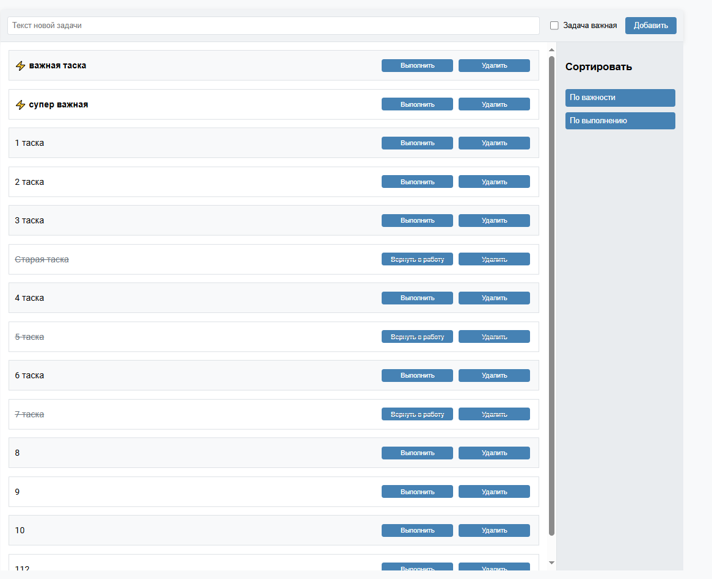
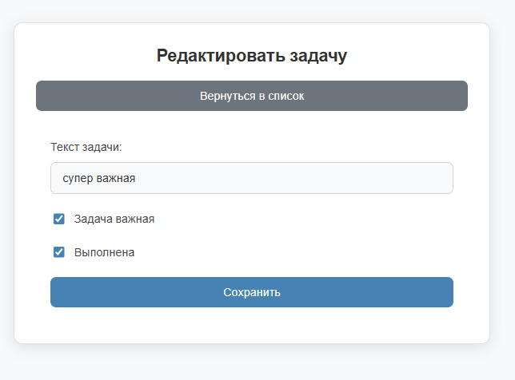

# 📋 TODO Приложение

!

## Само задание

- **Прямо из списка задач:**

  - Добавить новую задачу.
  - Удалить задачу.
  - Отметить задачу как выполненную.
  - Вернуть выполненную задачу в работу.
  - Отсортировать задачи по важности или выполненности.

- **Карточка задачи:**
  - Открыть задачу для редактирования.
  - Изменить текст, важность или статус выполненности.
  - Сохранить изменения.

### Маршрутизация

- `http://localhost:<port>/` — список задач без сортировки.
- `http://localhost:<port>/#/sort/importance` — список задач, отсортированный по важности.
- `http://localhost:<port>/#/sort/completed` — список задач, отсортированный по выполненности.
- `http://localhost:<port>/#/todo/123` — карточка задачи с указанным ID.

Каждая задача в списке отображает:

- Иконку важности.
- Текст задачи.
- Кнопки: "Выполнить" (для невыполненных задач), "Вернуть в работу" (для выполненных задач), "Удалить".

### Web API

Приложение взаимодействует с сервером через следующие методы:

- Получение списка задач (сортировка выполняется на клиенте).
- Добавление новой задачи.
- Удаление задачи.
- Обновление задачи.

- **React**: SPA с использованием функциональных компонентов и хуков.
- **TypeScript**.
- **Роутинг**: Не надо было писать свой маршрутизатор, поэтому встроенный.
- **Без Redux**: Сделала через контекст и хуки, так как в требованиях было написано без редакса.

### Стили и разметка

- **Flex-разметка**.
- **БЭМ**: Ну тут как смогла)

## Установка и запуск

В целом весь процесс описан в файле самого задания. Коротко: установить нод и нугет пакеты, далее запаблишить сервер, создать узлы в IIS(создавала по инструкции)
